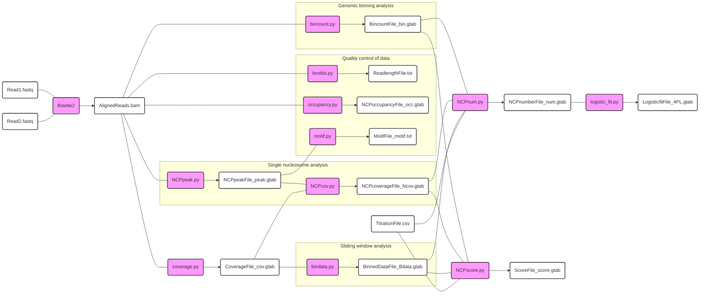

# Condense-seq

## Overview

Condense-seq is a high-throughput technique designed to directly measure the biophysical properties of native nucleosomes at a genome-wide scale with single-nucleosome resolution [1]. In this method, native mononucleosomes are purified from cells and condensed in vitro using various condensing agents, including polyamines, polycations, and heterochromatin proteins. By sequencing the supernatant phase of the condensate and comparing it to the input, the condensation propensity, or “condensability,” of individual genomic nucleosomes can be determined. Our findings demonstrate that native nucleosome condensability illuminates the biophysical principles driving eukaryotic genome organization [1].


## Analysis workflow
This is a summary of the workflow for Condense-seq analysis, from the FASTQ file processing to condensability score computation.



## Usage
The following is a list of custom Python scripts used for Condense-seq analysis, located in the *prepro_scripts* folder. Detailed usage instructions and execution examples are provided below click-and-drop menus. Many output files are formatted in the custom **gtab** (genomic table) format, a simple tab-delimited file with either the structure: Chromosome \<tab> Position \<tab> Value or Chromosome \<tab> Start \<tab> End \<tab> Value. (Note: Genomic coordinates are 0-based and half-open.)

<details>
<summary> bincount.py </summary> <br/>

Binning reference genome and get aligned read counts for each bin
  ```
  python bincount.py AlignedReads.bam -x ref_genome -w bin_size -o out_fname
  ```

**Positional Arguments:** <br/>
`-f` SAM/BAM filenames  
`-x` Reference sequence filename

**Optional Arguments:** <br/>
`-w` Bin window size in bp  
`-m` Mismatch cut-off in bp  
`--min` Minimum length for selection in bp  
`--max` Maximum length for selection in bp  
`--chr` Target chromosome list  
`--skip` Skip the zero count bins  
`--gc` GC content option  
`--tlen` Tlen option  
`-o` Output prefix filename  

</details>


<details>
<summary> coverage.py </summary> <br/>

Reading SAM/BAM files to get read coverage along reference genome.

  ```
  python coverage.py AlignedReads.bam -x ref_genome --chr chromosome -o out_fname --skip
  ```

**Positional Arguments:** <br/> 
`-f` SAM/BAM filenames  
`-x` Reference sequence filename  

**Optional Arguments:** <br/>
`-m` Mismatch cut-off in bp  
`--min` Minimum length for selection in bp  
`--max` Maximum length for selection in bp  
`--skip` Skip the zero coverage positions  
`--chr` Target chromosome list  
`-o` Output prefix filename

</details>


<details>
<summary> NCPpeak.py </summary> <br/>

Peak calling for each nucleosome positions

  ```
  python NCPpeak.py AlignedReads.bam -x ref_genome --chr chromosome -o out_fname --skip
  ```

**Positional Arguments:** <br/>
`-f` SAM/BAM filenames (last file used as control)  

**Optional Arguments:** <br/>
`-m` Mismatch cut-off in bp  
`--min` Minimum length for selection in bp (default: 126bp)  
`--max` Maximum length for selection in bp (default: 184bp)  
`--Nlen` Mono-nucleosomal length in bp  
`--ovlap` Maximum allowed overlap between NCPS in bp  
`--skip` Skip the zero coverage positions  
`--chr` Target chromosome list  
`-o` Output prefix filename  

</details>


<details>
<summary> NCPcov.py </summary> <br/>

Compute coverage area under each nucleosome peaks

  ```
  python NCPcov.py NCPpeakFile_peak.gtab CoverageFile_cov.gtab --chr chromosome -o out_fname
  ```

**Positional Arguments:** <br/>
`--peak` Peak gtab file  
`--cov` Coverage gtab file  

**Optional Arguments:** <br/>
`--peak-choice` NCP peak data choice (default: input control only, "all": all data)  
`--Nlen` Mono-nucleosomal window in bp  
`--chr` Target chromosome list  
`-o` Output prefix filename  

</details>


<details>
<summary> bindata.py </summary> <br/>

Compute coverage area for each sliding window along genome

  ```
  python bindata.py CoverageFile_cov.gtab -x ref_genome --Bsize bin_size --Bstep Bin_step --chr chromosome -o out_fname
  ```

**Positional Arguments:** <br/>
`-f` Data gtab file  
`-x` Reference sequence filename  

**Optional Arguments:** <br/>
`--Bsize` Bin window in bp  
`--Bstep` Bin moving step in bp  
`--Bvalue` Binning value choice (sum/mean)  
`--skip` Skip the zero coverage positions  
`--chr` Target chromosome list  
`-o` Output prefix filename  

</details>


<details>
<summary> NCPnum.py </summary> <br/>

Using reads coverage/counts and titration file, estimate molecular number of nucleosomes for each bin or peak

  ```
  python NCPnum.py BincountFile_bin.gtab | NCPcoverageFile_Ncov.gtab | BinnedDataFile_Bdata.gtab -t TitrationFile.csv --tnum TitrationNumber --chr chromosome -o out_fname
  ```

**Positional Arguments:** <br/>
`-f` Ncov/bin/Bdata.gtab file list  

**Optional Arguments:** <br/>
`-t` Titration filename  
`--tnum` Titration number of each data  
`--mscale` Total molecule number scale of input  
`--chr` Target chromosome list  
`-o` Output prefix filename  

</details>


<details>
<summary> NCPscore.py </summary> <br/>

Compute the condensability score, which is a negative log of molecular number ratio over input, for each genomic bin or peaks

  ```
  python NCPscore.py BincountFile_bin.gtab | NCPcoverageFile_Ncov.gtab | BinnedDataFile_Bdata.gtab -t TitrationFile.csv --tnum TitrationNumber --chr chromosome -o out_fname
  ```

**Positional Arguments:** <br/>
`-f` Ncov/bin/Bdata.gtab file list  

**Optional Arguments:** <br/>
`-i` Input control files (in same order of data files)  
`-t` Titration filename  
`--tnum` Titration number for each data (in same order of data files)  
`--numc` Correct scores using titration file  
`--metric` Score metric (-log[base], default: -log[e], None: No-log)  
`--chr` Target chromosome list  
`-o` Output prefix filename  

</details>


<details>
<summary> logistic_fit.py </summary> <br/>

Fit the logistic curves to molecular number changes over titrations for each genomic bins

  ```
  python logistic_fit.py NCPnumFile_num.gtab -t TitrationFile.csv --tnum TitrationNumber -m FittingModel -o out_fname
  ```

**Positional Arguments:** <br/>
`-f` Concatenated num.gtab file list  

**Options:** <br/>
`-t` Titration filename  
`--tnum` Titration number of each column in num data  
`--min_tnum` Minimum titration data number for fitting  
`--model` Logistic model for fitting data (sigmoid or hill)  
`--method` Logistic regression method (curve_fit or evolution)  
`--min_rsq` Minimum R-squared value for fitting quality  
`--min_top` Lower bound of Top parameter in 4PL model  
`--max_top` Upper bound of Top parameter in 4PL model  
`--min_bottom` Lower bound of Bottom parameter in 4PL model  
`--max_bottom` Upper bound of Bottom parameter in 4PL model  
`--min_rate` Lower bound of Rate parameter in 4PL model  
`--max_rate` Upper bound of Rate parameter in 4PL model  
`--min_chalf` Lower bound of C-half parameter in 4PL model  
`--max_chalf` Upper bound of C-half parameter in 4PL model  
`--chr` Target chromosome list  
`--graph` Plot the graphs fitting the data  
`-o` Output prefix filename  

</details>

## IPython notebook
All further analysis and graph generation are documented in IPython notebooks, which can be found in the *ipython_notebooks* folder

## Data deposition
All raw FASTQ files and processed data from the publication [1] have been deposited in NCBI GEO under accession number GSE252941.

## Publication

[1] https://www.biorxiv.org/content/10.1101/2023.12.08.570828v1

[](https://doi.org/10.5281/zenodo.15036148)

