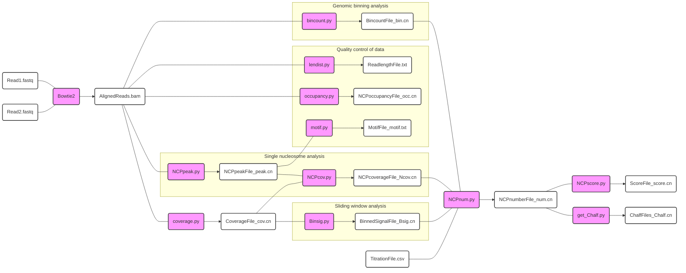

# Condense-seq

## Overview

Condense-seq is a high-throughput technique designed to directly measure the biophysical properties of native nucleosomes at a genome-wide scale with single-nucleosome resolution [1]. In this method, native mononucleosomes are purified from cells and condensed in vitro using various condensing agents, including polyamines, polycations, and heterochromatin proteins. By sequencing the supernatant phase of the condensate and comparing it to the input, the condensation propensity, or “condensability,” of individual genomic nucleosomes can be determined. Our findings demonstrate that native nucleosome condensability illuminates the biophysical principles driving genomic organization [1].

## Workflow



## Usage
<details>
<summary> bincount.py </summary>

Binning reference genome and get aligned read counts for each bin

  ```
  python bincount.py AlignedReads.bam -x ref_genome -w bin_size -o out_fname
  ```

</details>

<details>
<summary> coverage.py </summary>

Reading SAM/BAM files to get read coverage along reference genome.

  ```
  python coverage.py AlignedReads.bam -x ref_genome --chr chromosome -o out_fname --skip
  ```

</details>

</details>

<details>
<summary> NCPpeak.py </summary>

Peak calling for each nucleosome positions

  ```
  python NCPpeak.py AlignedReads.bam -x ref_genome --chr chromosome -o out_fname --skip
  ```

</details>

</details>

<details>
<summary> NCPcov.py </summary>

Compute coverage area under each nucleosome peaks

  ```
  python NCPcov.py NCPpeakFile_peak.cn CoverageFile_cov.cn --chr chromosome -o out_fname
  ```

</details>

</details>

<details>
<summary> Binsig.py </summary>

Compute coverage area for each sliding window along genome

  ```
  python Binsig.py CoverageFile_cov.cn -x ref_genome --Bsize bin_size --Bstep Bin_step --chr chromosome -o out_fname
  ```

</details>

<details>
<summary> NCPnum.py </summary>

Using titration file, estimate molecular number of nucleosomes for each bin or peak

  ```
  python NCPnum.py BincountFile_bin.cn | NCPcoverageFile_Ncov.cn | BinnedSigFile_Bsig.cn -t TitrationFile.csv --tnum TitrationNumber --chr chromosome -o out_fname
  ```

</details>

</details>

<details>
<summary> NCPscore.py </summary>

Get condensability score, which is a negative log of molecular number ratio over input, for each genomic bin or peaks

  ```
  python NCPscore.py NCPnumFile_num.cn --inpu NCPnumFile_num.cn -o out_fname
  ```

</details>

<details>
<summary> get_Chalf.py </summary>

Compute condensation point (C 1/2) by fitting logistic curve to molecular number changes over titrations

  ```
  python get_Chalf.py NCPnumFile_num.cn
  ```

</details>

## Publication

[1] https://www.biorxiv.org/content/10.1101/2023.12.08.570828v1
